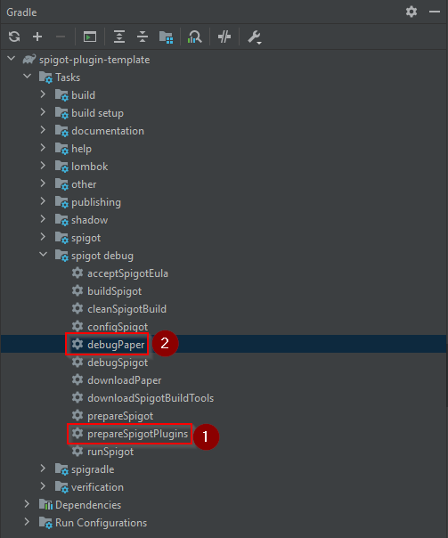

# Spigot Plugin Template

このテンプレートを使用すると、[Gradle](https://gradle.org/)を使用して高品質のSpigotプラグインを簡単に開発できます。

> Minecraftネットワークを30秒未満でクイックスタートするには、[minecraft-server-template](https://github.com/Silthus/minecraft-server-template)を参照してください。


* [機能](#features)
* [クイックスタートセットアップ](#quickstart-setup)
* [プラグインの新バージョンのリリース](#releasing-a-new-version-of-your-plugin)
  * [コミットメッセージのフォーマット](#commit-message-format)
* [Mavenパッケージの公開](#publishing-your-maven-package)
  * [グループとArtifactIdについて](#about-the-group-and-artifactid)
  * [Githubパッケージの認証](#github-package-authentication)
* [プラグインのデバッグ](#debugging-your-plugin)
  * [プラグインの自動コピー](#copy-your-plugin-automatically)
  * [Minecraftサーバーの実行とデバッグ](#running-and-debugging-the-minecraft-server)
* [参考文献](#references)

## 機能

このテンプレート、あるいはベストプラクティスは、高品質なプラグインを開発するために役立つ多くの機能を備えています。ただし、必要のない機能は削除することができます。

* [**Gradle**](https://gradle.org/) プロジェクトを使用する準備ができている。多くのユーティリティタスクが付属しています。
* [SpiGradle](https://github.com/EntryPointKR/Spigradle/)に基づいたプロジェクトプロパティに基づく `plugin.yaml` の自動生成
* [**Spigot テストサーバー**](https://github.com/EntryPointKR/Spigradle/) を統合し、クリックひとつでビルドし、プラグインをコピーし、IntelliJでデバッグを開始するタスクが実現可能
* [**Gradle shadow plugin**](https://imperceptiblethoughts.com/shadow/) を使用して、必要な依存関係を簡単にプラグインと一緒に出荷
* [Annotation Command Framework](https://github.com/aikar/commands/) および [Vault](https://github.com/MilkBowl/VaultAPI) のテストを含む統合の例
* [JUnit 5](https://junit.org/junit5/docs/current/user-guide/)テストセットアップ（[MockBukkit](https://github.com/seeseemelk/MockBukkit)と[AssertJ](https://joel-costigliola.github.io/assertj/)を含む）
* [Jacoco](https://github.com/jacoco/jacoco)コードカバレッジレポート（[codecov](https://codecov.io/)へのアップロードタスクを含む）
* 完全に統合された[**semantic-release**](https://semantic-release.gitbook.io/semantic-release/)リリースパイプライン
* [慣例的なコミットメッセージ](https://www.conventionalcommits.org/)に基づく自動[変更ログ生成](https://github.com/semantic-release/changelog)
* ビルドとリリースのための[**Github Actions**](https://github.com/features/actions)ワークフロー
* [GitHub Packages](https://github.com/features/packages)への**mavenアーティファクト**の公開
  > 自己ホスト型nexusやartifactoryサーバーはもう必要ありません
* バグや機能リクエストのためのGitHub [**issueテンプレート**](https://help.github.com/en/github/building-a-strong-community/configuring-issue-templates-for-your-repository)
* 貢献と行動規範の**ガイドライン**
* プロジェクトを表示するための素晴らしい[**バッジ**](https://shields.io)

## クイックスタートセットアップ

* このテンプレートを使用して[新しいGithubプロジェクト](https://github.com/Silthus/spigot-plugin-template/generate)を作成します。
* **クローン**して、IntelliJで開きます。
* **gradle.properties** ファイルを **更新**し、以下の変数を変更します。
  * `group`: あなたのMavenグループID（例：io.github.silthus）
  * `pluginName`: あなたのプラグイン名
  * `author`: あなたの名前
* **settings.gradle** 内の `root.projectName` を更新してください。これがあなたの `artifactId` になります。
* **CHANGELOG.md** を削除してください。これはあなたの [最初のリリース](#releasing-a-new-version-of-your-plugin) で生成されます。
* **README** を更新して、あなたのプロジェクトと Spigot リソース ID を指すようにしてください。
* **Javaパッケージ名** とプラグイン名を、あなたのプロジェクトに合わせてリネームしてください。
* 次に、 `prepareSpigotPlugins` Gradle タスクを実行してください。これにより、すべてのプラグインの依存関係がダウンロードされ、 `debug/spigot/plugins/` に配置されます。
* `debugPaper` タスクを実行して、Minecraftサーバーを起動してください。これにより、サーバーがバックグラウンドで開始され、 `localhost:25565` アドレスを使用して接続できます。
* **コーディングしましょう :)** - *そして準備ができたら、あなたのコミットを [慣例的なコミットスタイル](#commit-message-format) でマスターにプッシュしてください。*



プルリクエストを送信する前に、[貢献ガイドライン(CONTRIBUTING.md)](CONTRIBUTING.md)を読んでください。

> **注意**  
> パッケージ名を変更した後に `gradle clean` タスクを実行して、`plugin.yml` の生成に関するエラーを解決するために、gradleプロジェクトを再インポートする必要がある場合があります。

## プラグインの新しいバージョンのリリース

このテンプレートの主な利点の1つは、コミットメッセージに基づいて、`master` ブランチへのプッシュごとに、新しいバージョンが **自動的にリリース** されることです。これにより、[semantic versioning](https://semver.org/) のガイドラインに従って、プラグインがリリースされることが保証されます。これが機能するためには、いくつかの簡単なルールに従う必要があります。
* masterブランチには、動作確認が完了しているコードのみをコミットしてください。*大規模な機能やバグ修正を行う場合は、プルリクエストを使用し、準備ができたらマージしてください。*
* すべてのバグ修正、機能、変更には、1つのコミットが関連付けられる必要があります。*複数のバグ、機能などを1つの巨大なコミットメッセージに混ぜないでください。コミットのサイズを小さくし、頻繁にコミットしてください。*
* コミットメッセージは、[Conventional Commitsルール](https://www.conventionalcommits.org/)に従う必要があります。

### コミットメッセージのフォーマット

より詳しい情報や例については、[conventional commitのホームページ](https://www.conventionalcommits.org/)を参照してください。ここでは、はじめるための簡単な要約を提供します。

> Conventional Commits 仕様は、コミットメッセージの上に置かれた軽量な規約です。明示的なコミット履歴を作成するための簡単なルールを提供し、自動化ツールをより簡単に作成することができます。この規約は、[SemVer](http://semver.org/)と組み合わせて、コミットメッセージで行われた機能、修正、および破壊的変更を説明します。

コミットメッセージは、以下のように構成する必要があります：

```text
<type>[optional scope]: <description>

[optional body]

[optional footer(s)]
```
コミットには、ライブラリまたはプラグインの消費者に意図を伝えるために、以下の構造要素が含まれます。

* `fix:` 修正のタイプのコミットは、コードベースのバグを修正します（これはセマンティックバージョニングにおけるPATCHに相当します）。
* `feat:` 機能のタイプのコミットは、コードベースに新しい機能を導入します（これはセマンティックバージョニングにおけるMINORに相当します）。
* `BREAKING CHANGE:` フッターに BREAKING CHANGE: を含むまたはタイプ/スコープの後ろに ! を追加するコミットは、破壊的なAPI変更を導入します（セマンティックバージョニングにおけるMAJORに相当します）。BREAKING CHANGEは、任意のタイプのコミットの一部となる可能性があります。
* `fix:` および `feat:` 以外のタイプも許可されており、たとえば @commitlint/config-conventional（Angular規約に基づく）では、`build:`、`chore:`、`ci:`、`docs:`、`style:`、`refactor:`、`perf:`、`test:`などを推奨しています。
* BREAKING CHANGE以外のフッターには、gitトレイラーフォーマットに似た規約に従うことができます。
  追加のタイプはConventional Commits仕様によって強制されるものではありません。セマンティックバージョニングに暗黙の影響はありません（BREAKING CHANGEを含む場合を除く）。

スコープは、コミットのタイプに追加の文脈情報を提供するために、括弧内に含まれることがあります。例： `feat(parser): add ability to parse arrays`。

以下はいくつかの例です

<details>
<summary>説明と破壊的変更フッターを含むコミットメッセージ</summary>

```text
feat: 提供された設定オブジェクトが他の設定を拡張できるようにする

破壊的変更: 設定ファイルの `extends` キーは、他の設定ファイルを拡張するために使用されます。
```

</details>

<details>
<summary>本文のないコミットメッセージ</summary>

```text
docs: CHANGELOGの綴りを修正
```

</details>

<details>
<summary>スコープ付きのコミットメッセージ</summary>

```text
feat(lang): ポーランド語を追加
```

</details>

<details>
<summary>マルチパラグラフの本文と複数のフッターを持つコミットメッセージ</summary>

```text
fix: コード中の細かいタイプミスを修正

詳細は問題を参照してください。

修正されたタイポについての詳細は以下の通りです。

Reviewed-by: Z
Refs #133
```

</details>

## Mavenパッケージの公開

[新しいバージョンをリリース](#releasing-a-new-version-of-your-plugin)すると、あなたのプラグインは自動的に [Github packages](https://github.com/features/packages) 上でmavenパッケージとして公開されます。

### グループとArtifactIdについて

あなたの`artifactId`に追加される`group`は、他のプロジェクトでそれをインポートする際に、あなたのプロジェクトを一意に識別するために使用されます。たとえば、あなたが自分のプロジェクトでspigotをインポートする場合、groupに`org.spigotmc`、artifactIdに`spigot-api`を使用してバージョンを指定します。

以下は、[公式のmaven命名規則ガイド](https://maven.apache.org/guides/mini/guide-naming-conventions.html)から引用したものです。

* `groupId`はすべてのプロジェクト全体であなたのプロジェクトを一意に識別します。group IDは[Javaのパッケージ名規則](https://docs.oracle.com/javase/specs/jls/se6/html/packages.html#7.7)に従う必要があります。これは、あなたが制御する逆ドメイン名で始まる必要があります。たとえば：`org.apache.maven`、`org.apache.commons`。ドメインを所有していない場合、Githubのドメインである`io.github`にあなたのGithubのユーザー名を追加することができます。たとえば、`io.github.silthus`
* `artifactId`は、バージョンなしのjarの名前です。あなたが作成した場合、小文字で任意の名前を選択できますが、奇妙な記号は使わないでください。例：`maven`、`commons-math`

### Githubパッケージの認証

他のプロジェクトであなたのMavenパッケージを使用する場合は、[Githubパッケージの認証を設定する必要があります](https://help.github.com/en/packages/using-github-packages-with-your-projects-ecosystem/configuring-gradle-for-use-with-github-packages#authenticating-to-github-packages)。

1. [Githubのパーソナルアクセストークンを作成します](https://help.github.com/ja/github/authenticating-to-github/creating-a-personal-access-token-for-the-command-line)。
2. `C:\Users\%username%\.gradle` 内の `gradle.properties` を作成または更新し、以下のように置き換えます。`YOUR_GITHUB_USERNAME`をGithubのユーザー名に、`YOUR_PERSONAL_ACCESS_TOKEN`を1.で取得したアクセストークンに置き換えます。
```properties
gpr.user=YOUR_GITHUB_USERNAME
gpr.key=YOUR_PERSONAL_ACCESS_TOKEN
```

## プラグインのデバッグ

### プラグインの自動コピー

Gradleの**prepareSpigotPlugins**タスクを使用して、作業ディレクトリからプラグインを`plugins/`ディレクトリに**ビルドしてコピーする**ことができます。

### Minecraftサーバーの実行とデバッグ

IntelliJ内から`Server`実行構成を使用して、Minecraftサーバーを自動的にダウンロードし、ビルドして、あなたと依存関係のあるプラグインをコピーして、デバッグモードで起動することができます。

これは、Spigradleのデバッグタスクの素晴らしい機能のおかげです。詳細については、[SpigradleのGithubページ](https://github.com/spigradle/spigradle)を参照してください。

## 参考文献

* [Spigradle](https://github.com/spigradle/spigradle/): *あなたの生活をずっと楽にしてくれる素晴らしいgradleタスクを提供します*
* [semantic-release](https://semantic-release.gitbook.io/semantic-release/): *私の意見では、すべてのプロジェクトがこれを使うべきです！*
* [conventional commit messages](https://www.conventionalcommits.org/): *正しい方法でコミットメッセージを行います*
